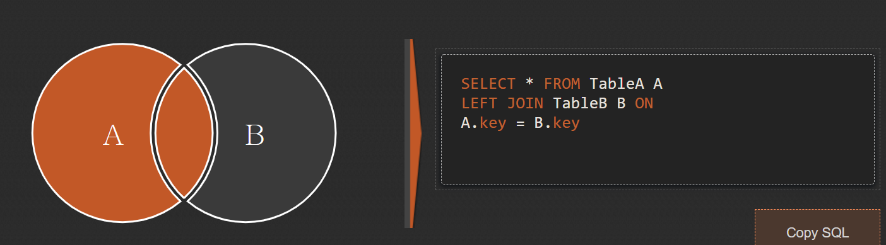
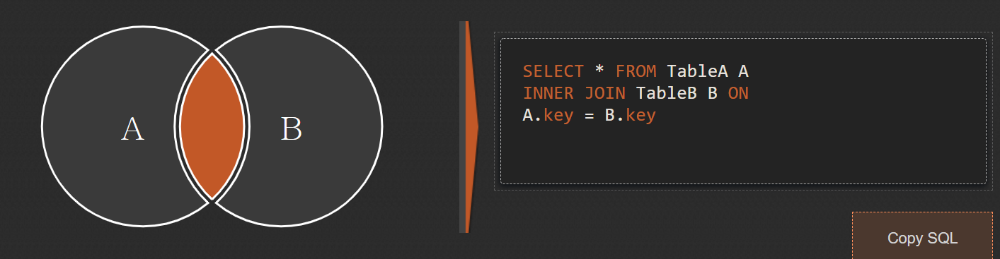
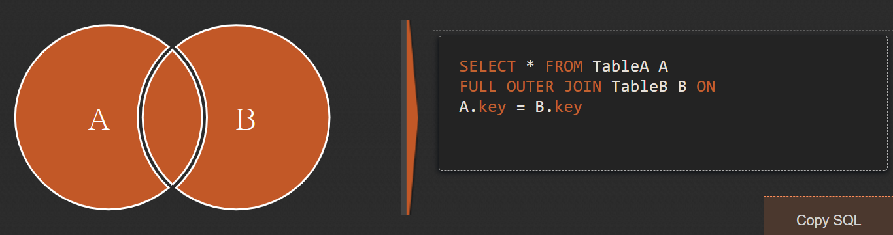
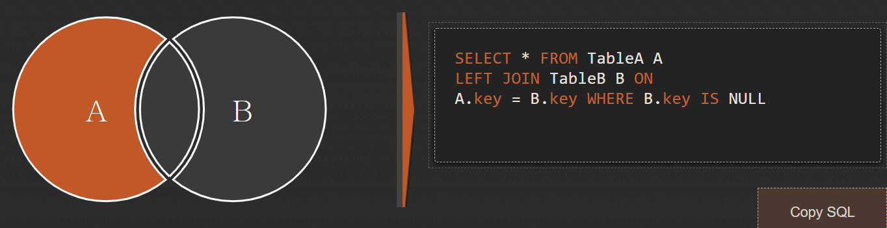

# SQL Join

실습하기 : https://docs.google.com/spreadsheets/d/1qhzxaxoKYudQkhFyjGyBfmGYZ-dEAH1nsuyomzdyUB4/edit#gid=1849152573

SQL Joins Visualizr : https://sql-joins.leopard.in.ua/

### 예시 표

> 보기가 좋다 사용하기(수정하기)가 불편하다

| topic |          |                |         |      |           |                 |
| ----- | -------- | -------------- | ------- | ---- | --------- | --------------- |
| tid   | title    | description    | name    | city | job_title | job_description |
| 1     | HTML     | HTML is …      | egoing  | jeju | developer | developer is …  |
| 2     | CSS      | CSS is …       | leezche | jeju | designer  | designer is …   |
| 3     | Database | Database is .. | egoing  | jeju | developer | developer is …  |


### 표 쪼개기 

> 보기는 어렵지만 수정이 용이하다

| topic |          |                |           |
| ----- | -------- | -------------- | --------- |
| tid   | title    | description    | author_id |
| 1     | HTML     | HTML is …      | 1         |
| 2     | CSS      | CSS is …       | 2         |
| 3     | Database | Database is .. | 1         |

| author |         |       |            |
| ------ | ------- | ----- | ---------- |
| id     | name    | city  | profile_id |
| 1      | egoing  | seoul | 1          |
| 2      | leezche | jeju  | 2          |

| profile |           |                 |
| ------- | --------- | --------------- |
| id      | job_title | job_description |
| 1       | developer | developer is …  |
| 2       | designer  | designer is …   |


### LEFT JOIN

> left join은 기준이 되는 표를 왼쪽에 두고, 이 표를 기준으로 오른쪽의 표를 합성해서 하나의 표를 만드는 방법이다.



```sql
SELECT * FROM topic **LEFT JOIN author ON topic.author_id = author.aid
```

> topic과 author의 join

| tid  | title    | description    | author_id | aid  | name    | city  | profile_id |
| ---- | -------- | -------------- | --------- | ---- | ------- | ----- | ---------- |
| 1    | HTML     | HTML is …      | 1         | 1    | egoing  | seoul | 1          |
| 2    | CSS      | CSS is …       | 2         | 2    | leezche | jeju  | 2          |
| 3    | Database | Database is .. | 1         | 1    | egoing  | seoul | 1          |
| 4    | Oracle   | Oracle is …    | NULL      | NULL | NULL    | NULL  | NULL       |


### INNER JOIN 교집합!

> INNER JOIN은 왼쪽과 오른쪽 표 모두에서 존재하는 행를 모아서 하나의 행을 만드는 방법



```sql
SELECT * FROM topic **INNER JOIN author ON topic.author_id = author.aid
```

| tid  | title    | description    | author_id | aid  | name    | city  | profile_id |
| ---- | -------- | -------------- | --------- | ---- | ------- | ----- | ---------- |
| 1    | HTML     | HTML is …      | 1         | 1    | egoing  | seoul | 1          |
| 2    | CSS      | CSS is …       | 2         | 2    | leezche | jeju  | 2          |
| 3    | Database | Database is .. | 1         | 1    | egoing  | seoul | 1          |


### FULL OUTER JOIN 합집합!

> 왼쪽과 오른쪽에 있는 행 모두를 합성해서 하나의 표를 만드는 방법 



```sql
SELECT * FROM topic **FULL OUTER JOIN author ON topic.author_id = author.id**

위의 코드를 지원하지 않는 경우 

(SELECT * FROM topic LEFT JOIN author ON topic.author_id = author.id) UNION (SELECT * FROM topic RIGHT JOIN author ON topic.author_id = author.id)
```

단순하게 LEFT Join(왼쪽테이블 기준 합성), RIGHT Join(오른쪽 테이블 기준 합성) 한 뒤에 중복된거 제거라고 생각하자 합집합이니....

| tid  | title    | description    | author_id | aid  | name     | city   | profile_id |
| ---- | -------- | -------------- | --------- | ---- | -------- | ------ | ---------- |
| 1    | HTML     | HTML is …      | 1         | 1    | egoing   | seoul  | 1          |
| 2    | CSS      | CSS is …       | 2         | 2    | leezche  | jeju   | 2          |
| 3    | Database | Database is .. | 1         | 1    | egoing   | seoul  | 1          |
| 4    | Oracle   | Oracle is …    | NULL      | NULL | NULL     | NULL   | NULL       |
| NULL | NULL     | NULL           | NULL      | 3    | blackdew | namhae | 3          |


# EXCLUSIVE JOIN 

> 한쪽 표에만 있는 정보로 새로운 표를 만드는 방법



```sql
SELECT * FROM topic LEFT JOIN author ON topic.author_id = author.aid WHERE author.aid is NULL
```

| tid  | title  | description | author_id | aid  | name | city | profile_id |
| ---- | ------ | ----------- | --------- | ---- | ---- | ---- | ---------- |
| 4    | Oracle | Oracle is … | NULL      | NULL | NULL | NULL | NULL       |