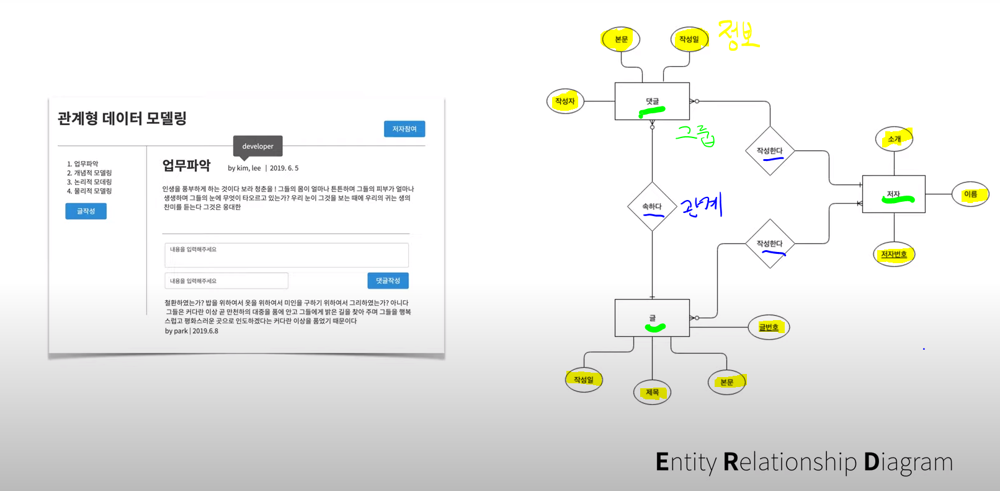
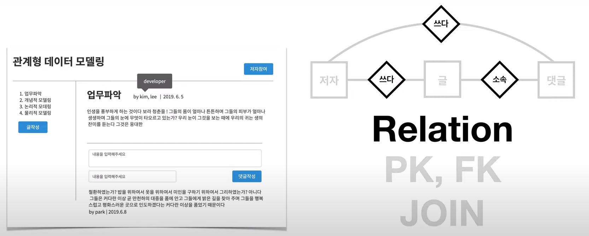

# 관계형 데이터 모델링

**업무파악 -> 개념적 데이터 모델링 -> 논리적 데이터 모델링 -> 물리적 데이터 모델링**

## 1. 업무파악(기획)

프로젝트 프로토타입 만들기 : https://ovenapp.io/

---

## 2. 개념적 데이터 모델링

모델링 하기 : https://app.diagrams.net/

#### Entity Relationship Diagram

현실에서 개념을 추출하는 필터 제공

개념에 대해서 다른 사람들과 대화하게 해주는 언어

정보,그룹,관계

---

어떻게 작성할까?? 포함관계인 위쪽인가, 평면적인 아래쪽인가?

다음과 같이 아래쪽처럼 설계하고 JOIN을 사용하게 되면 우리가 원하는 값을 쉽게 얻어낼 수 있다. 그래서 아래쪽과 같이 설계하자!

---

이제 ERD 안에 각각을 간략히 살펴보자!

#### Entity -> Table

> 개념. ERD에서는 entity

#### Attribute(속성) -> Column

> 실제 데이터, 구체적인 데이터로 여기서 저자가 속성이 되지 않는 이유는 저자는 entity로서 담을 데이터가 있으므로 attribute가 될 수 없다!

#### Relation(관계) -> PK,FK,JOIN

>entity간의 관계 설정

#### Tuple -> Row

---

### 이런 순서로 작성하자!

**엔티티지정!**

**속성지정!**

속성중에 대표자를 선정인 **식별자 지정**! (원하는 대상을 정확하게 정하는 것 자동차 번호)  ->PK가 된다

> 같은 값을 가지지 않는 것으로 지정해야한다.

> 다음과 같이 직원번호와 부서 번호 두개를 통해 식별할 경우

> 식별자로 지정할 것이 없다면 대리키를 통해 식별자를 설정한뒤 밑줄을 통해 구분한다.
>
> 엔티티는 네모, 속성은 원, 관계는 마름모를 사용

**Relationship 지정!** 

> 저자는 글(댓글)을 쓰고 글(댓글)은 저자에게 글(댓글)씀을 당하므로 작성 관계에 있고 댓글은 글에 포함되므로 소속 관계에 있다.

관계를 정하기 전에 꼭 정하고 가야하는 것 알고가자!!

Carinality 카디널리티(Cardinality, 기수성)는 특정 데이터 집합의 유니크(Unique)한 값의 개수

> 1-1 관계 한 선생남은 한 반을 담임하고 한 반의 담임도 한명인 경우

> 1-N 관계 저자는 여러 댓글을 달 수 있고 각 댓글은 하나의 저자를 가진다.

> N-M 관계 저자는 여러 글을 쓸 수 있고 하나의 글은 여러 저자가 입력할 수 있다고 할때.

Optionality

> 저자는 댓글을 달수도 있고 안달수도 있으니 option(0)이지만 댓글의 입장에선 저자는 무조건 있어야 하므로 mandatory(|)가 된다. 뿐만아니라 1대 다구조를 가지기 때문에 아래와 같이 된다

한눈에 보기!

이걸 통해서 만들면

헷갈릴때! http://erd.yah.ac/ 사용해

---

## 3. 논리적 데이터 모델링

> Mapping rule을 중점적으로 진행

다른 경우는 앞서 했던 모델링을 통해 만들면 된다. 

하지만 다음과 같이 N-M인 경우 다음과 같이 mapping table을 새로 만든다. 

완성된 모델은 다음과 같다

저자는 작성을 할 수도 있고 안 할 수도 있으니 옵션(0~N)이 되고 작성은 저자가 필수가 되어야 한다. 또한 글이 있다면 작성이 있어야 하므로 필수(1..N)이여야 하고 작성이 있다면 글이 있어야 하므로 필수(1)여야한다. 

---

## 4. 논리적 데이터 모델링2-정규화

> 정규화는 평범한 표를 관계형 데이터 베이스에 어울리는 비범한 표로 만드는 공정을 말한다

정규화 폼 : https://docs.google.com/spreadsheets/d/1iCQBYcBCM3a36nnOF-6lUByYGYXWjiXFbqrDdEww_F0/edit#gid=251854387

3단계로 나눈다.

**제1 정규형** : Atomic columns(각각의 열이 하나의 값만 가져라)

> tag에 보면 중복된 값이 존재한다. 이것을 제거하자

| topic  |        |               |         |           |             |                |       |                     |
| ------ | ------ | ------------- | ------- | --------- | ----------- | -------------- | ----- | ------------------- |
| title  | type   | description   | created | author_id | author_name | author_profile | price | tag                 |
| MySQL  | paper  | MySQL is ...  | 2011    | 1         | kim         | developer      | 10000 | **rdb, free**       |
| MySQL  | online | MySQL is ...  | 2011    | 1         | kim         | developer      | 0     | **rdb, free**       |
| ORACLE | online | ORACLE is ... | 2012    | 1         | kim         | developer      | 0     | **rdb, commercial** |

topic과 tag의 관계는 MYSQL에서 보면 rdb, free이고 rdb에서 보면 MYSQL, ORACLE 이므로 N대 M 관계이다. 따라서 새로운 테이블(매핑, 연결테이블)을 가져야 한다.

| topic  |        |               |         |           |             |                |       |
| ------ | ------ | ------------- | ------- | --------- | ----------- | -------------- | ----- |
| title  | type   | description   | created | author_id | author_name | author_profile | price |
| MySQL  | paper  | MySQL is ...  | 2011    | 1         | kim         | developer      | 10000 |
| MySQL  | online | MySQL is ...  | 2011    | 1         | kim         | developer      | 0     |
| ORACLE | online | ORACLE is ... | 2012    | 1         | kim         | developer      | 0     |

| topic_tag_relation |        |
| ------------------ | ------ |
| topic_title        | tag_id |
| MySQL              | 1      |
| MySQL              | 2      |
| ORACLE             | 1      |
| ORACLE             | 3      |

| tag  |            |
| ---- | ---------- |
| id   | name       |
| 1    | rdb        |
| 2    | free       |
| 3    | commercial |

**제 2정규형** : 부분 종속성이 없어야 한다. 즉, 테이블에 중복키를 없애자

> 굵게 표시한 부분이 부분 종속성을 의미한다. 오직 title에만 의존하고 type에는 의존하지 않으며 같은 값을 가진다.

| topic  |        |                  |          |           |             |                |       |
| ------ | ------ | ---------------- | -------- | --------- | ----------- | -------------- | ----- |
| title  | type   | description      | created  | author_id | author_name | author_profile | price |
| MySQL  | paper  | **MySQL is ...** | **2011** | **1**     | **kim**     | **developer**  | 10000 |
| MySQL  | online | **MySQL is ...** | **2011** | **1**     | **kim**     | **developer**  | 0     |
| ORACLE | online | ORACLE is ...    | 2012     | 1         | kim         | developer      | 0     |

title에만 종속되게 만들면 중복된 값을 제거 할 수 있다.

| topic  |               |         |           |             |                |
| ------ | ------------- | ------- | --------- | ----------- | -------------- |
| title  | description   | created | author_id | author_name | author_profile |
| MySQL  | MySQL is ...  | 2011    | 1         | kim         | developer      |
| ORACLE | ORACLE is ... | 2012    | 1         | kim         | developer      |

그리고 값은 title과 type에 따라 결정되므로 이렇게 한다.

| topic_type |        |       |
| ---------- | ------ | ----- |
| title      | type   | price |
| MySQL      | paper  | 10000 |
| MySQL      | online | 0     |
| ORACLE     | online | 0     |

**제 3정규형(No transitive dependencies)** : 이행적 종속성을 제거하자

> 굵게 표시한 부분이 이행적 종속성을 의미한다. author_id에 종속한다.

| topic  |               |         |           |             |                |
| ------ | ------------- | ------- | --------- | ----------- | -------------- |
| title  | description   | created | author_id | author_name | author_profile |
| MySQL  | MySQL is ...  | 2011    | **1**     | **kim**     | **developer**  |
| ORACLE | ORACLE is ... | 2012    | **1**     | **kim**     | **developer**  |

그래서 다음과 같이 나누면 author는 한개로 만들어진다.

| author |             |                |
| ------ | ----------- | -------------- |
| id     | author_name | author_profile |
| 1      | kim         | developer      |

| topic  |               |         |           |
| ------ | ------------- | ------- | --------- |
| title  | description   | created | author_id |
| MySQL  | MySQL is ...  | 2011    | 1         |
| ORACLE | ORACLE is ... | 2012    | 1         |

---

## 5. 물리적 데이터 모델링

> 논리적 데이터 모델링이 관계형 데이터베이스 패러다임에 잘 맞는 이상적인 표를 만드는 것이었다면, 물리적 데이터 모델링은 선택한 데이터베이스 제품에 만는 현실적인 고려는 하는 방법론입니다. 이 단계에서 가장 중요한 것은 성능입니다. 특히 역정규화(반정규화, denormalization)의 사례를 집중적으로 다룹니다. 
